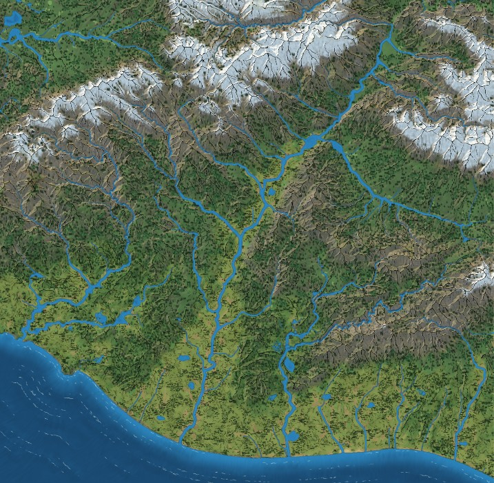
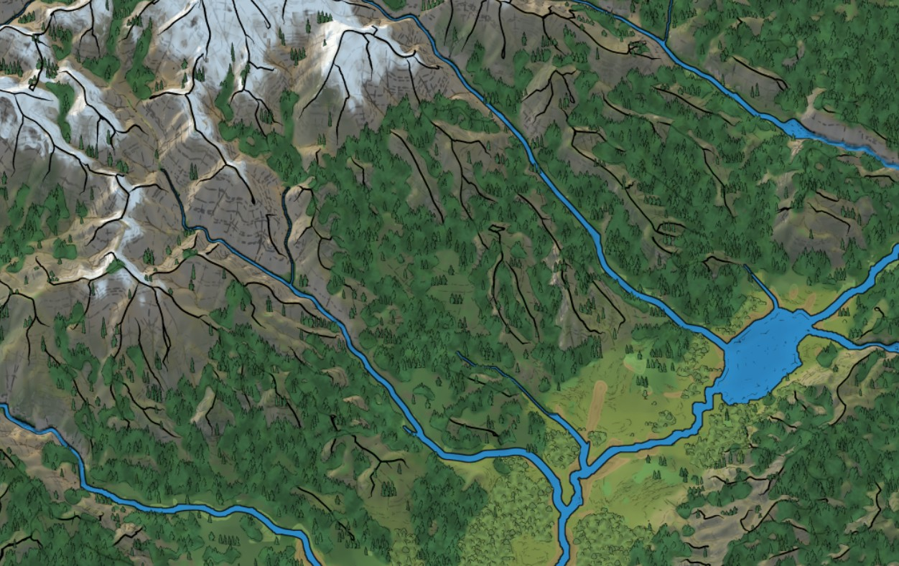
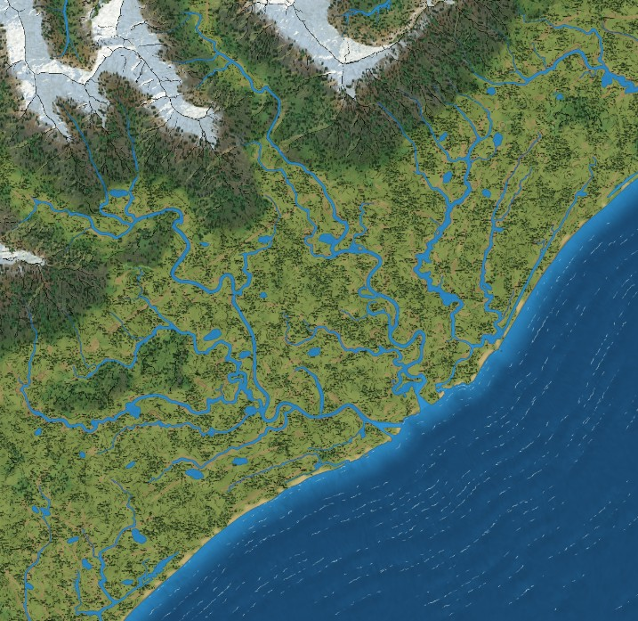
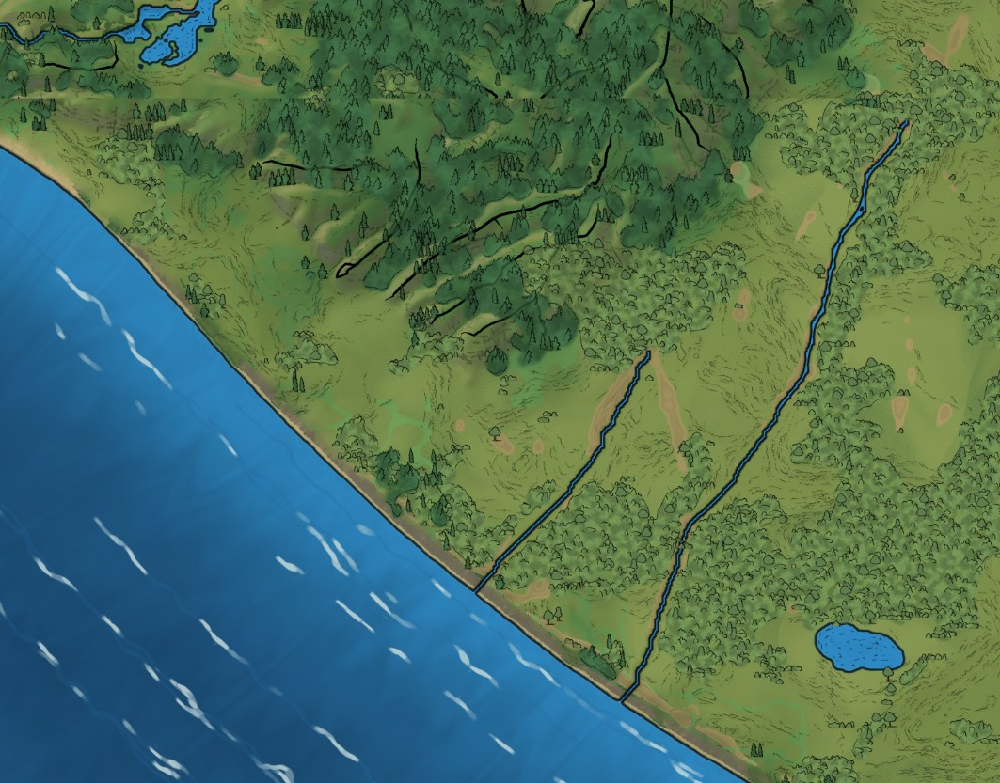

# Hatchlas

Turn a real-world heightmap into a hand-drawn style fantasy mountain map, right in your browser.

You load a heightmap (PNG or GeoTIFF). The app works out rivers, lakes, snow lines and biomes from the terrain, then paints it as an illustrated map: inked mountain faces, charcoal-style river and shore lines, forest stands, wetlands and wash colors. The look is visually inspired by Mike Schley's regional maps. No artwork from his maps is included, and this project is not affiliated with or endorsed by him or any publisher.



<table>
  <tr>
    <td></td>
    <td></td>
    <td></td>
  </tr>
</table>

## Features

- **Heightmap in, map out**: 16-bit PNG, or single-band uncompressed TIFF/GeoTIFF. A sample New Zealand DEM is bundled.
- **Terrain analysis**: drainage, river order, floodplain silt, lakes, slope, snow line and biomes, all from the elevation data. You can inspect each layer.
- **Illustrated mountains**: ridge-aware mountain faces with ink lines, hatching, snow and wash, plus a tilted full-terrain camera view.
- **Water**: rivers, shorelines, wave marks and wetland pools drawn as ink strokes.
- **Vegetation**: forest stands, shrubs and reeds placed by biome suitability, drawn from the SVG props in `src/assets/`.
- **Contours and palettes**: contour lines with index lines, and several relief palettes.
- **High-resolution export**: PNG up to 16K, optionally as 4 strips or a selected region.
- **Optional WebGPU**: speeds up the preparation step when your browser supports it. Everything works without it.

## Quick start

You need Node.js 20.19 or newer.

```bash
npm install
npm run dev
```

Open the address Vite prints (usually http://localhost:5173). Mountain Studio loads with the sample heightmap. Use the file picker to load your own.

Extra dev pages, used while tuning the artwork: `/forest-lab`, `/forest-props` and `/pool-lab`.

Other commands:

```bash
npm run build      # type-check and build for production
npm run typecheck  # types only
npm run lint
```

## Using your maps

Maps, heightmaps and other files you export are yours. Use them for anything, including commercial projects, with no attribution needed. The source code itself is licensed under the AGPL-3.0 (see below).

## How it is built

React 19, TypeScript and Vite, with Tailwind for styling. Rendering is plain Canvas 2D plus optional WebGPU. Heavy work (previews and exports) runs in Web Workers so the UI stays responsive.

```
src/
  components/   UI, including MountainDetailStudio (the app) and the dev lab pages
  rendering/    mountain, water and vegetation renderers, workers and the export pipeline
  terrain/      heightmap processing: DEM loading, drainage, biomes
  assets/       SVG props and the bundled sample heightmaps
```

Files start with a short comment saying what they do. `tests/` holds the Vitest suite.

## Development and testing

This is a personal project, so validate the thing you changed. Start with one test file, and use a visual check for appearance changes.

```bash
npm test -- tests/mountainBaseDEM.test.ts
npm test -- tests/mountainBaseDEM.test.ts -t "test name"
```

Bare `npm test` prints usage and exits. `npm run test:full` runs everything, and `npm run test:changed` runs tests affected by your uncommitted changes (which can be a lot of files).

## Contributing

Issues and pull requests are welcome, though this is a one-person hobby project, so replies may be slow. By contributing you agree that your contribution is licensed under the AGPL-3.0, with the export permission described in [NOTICE.md](NOTICE.md).

## Support the project

If this saved you time, you can sponsor development:

- [GitHub Sponsors](https://github.com/sponsors/timvandingenen1993)
- [Ko-fi](https://ko-fi.com/timvandingenen1993)

## License

The code is licensed under the [GNU Affero General Public License v3.0 or later](LICENSE), with an additional permission: files you generate with the app are not covered by it. See [NOTICE.md](NOTICE.md) for the details, third-party credits and data attribution.

Elevation data: contains data sourced from the LINZ Data Service, licensed for reuse under [CC BY 4.0](https://creativecommons.org/licenses/by/4.0/).
