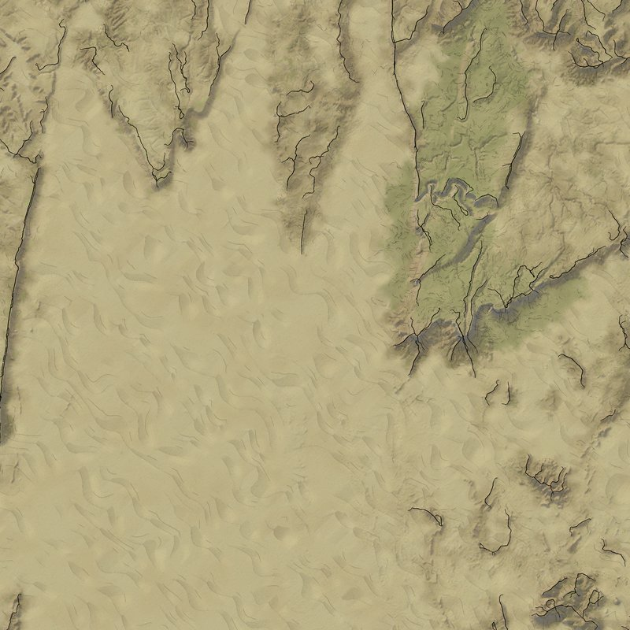
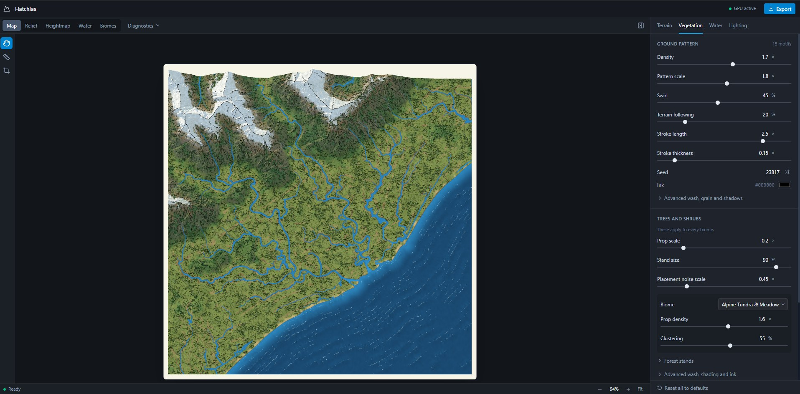

<div align="center">

# Hatchlas

**Turn a real-world heightmap into a hand-drawn fantasy mountain map, right in your browser.**

[](https://hatchlas.pages.dev)
[](LICENSE)
[](https://github.com/sponsors/timvandingenen1993)
[](https://ko-fi.com/timvandingenen1993)

[**Try it live**](https://hatchlas.pages.dev) · [Features](#features) · [Getting started](#getting-started) · [Support](#support-the-project)


</div>

## About

Load a heightmap (PNG or GeoTIFF) and Hatchlas works out rivers, lakes, snow lines and biomes (including deserts and dry steppe) from the terrain. It then paints the result as an illustrated map, with inked mountain faces, charcoal-style river and shore lines, forest stands, wetlands and wash colors.

Everything runs client-side. There is nothing to install, and your heightmaps never leave your machine. A desktop browser works best.

> [!NOTE]
> The style is visually inspired by Mike Schley's regional maps. No artwork from his maps is included, and this project is not affiliated with or endorsed by him or any publisher.

## Gallery

<table>
  <tr>
    <td width="25%"></td>
    <td width="25%"></td>
    <td width="25%"></td>
    <td width="25%"></td>
  </tr>
  <tr>
    <td align="center"><sub>Mountain valley</sub></td>
    <td align="center"><sub>River plain</sub></td>
    <td align="center"><sub>Coast close-up</sub></td>
    <td align="center"><sub>Desert dunes</sub></td>
  </tr>
</table>

**Full resolution:** [8K export (8117×8192, 12 MB WebP)](screenshots/export-8k.webp)

### The editor



## Features

| Feature | Details |
|---|---|
| **Heightmap in, map out** | 16-bit PNG, or single-band uncompressed TIFF/GeoTIFF. A sample New Zealand DEM is bundled. |
| **Terrain analysis** | Drainage, river order, floodplain silt, lakes, slope, snow line, orographic rainfall and biomes, all derived from the elevation data. Biomes follow Holdridge life zones. Each layer can be inspected. |
| **Illustrated mountains** | Ridge-aware mountain faces with ink lines, hatching, snow and wash, plus a tilted full-terrain camera view. |
| **Water** | Rivers, shorelines, wave marks and wetland pools drawn as ink strokes. |
| **Vegetation** | Forest stands, shrubs and reeds placed by biome suitability, drawn from the SVG props in `src/assets/`. |
| **Deserts** | Procedural dunes for sand deserts, with adjustable spacing, crest shape, shading and ripples. Rocky deserts use flow-line marks. |
| **Contours and palettes** | Contour lines with index lines, and several relief palettes. |
| **High-resolution export** | PNG up to 16K, optionally as 4 strips or a selected region. |
| **Optional WebGPU** | Speeds up the preparation step when your browser supports it. Everything works without it. |

## Getting started

### Prerequisites

- [Node.js](https://nodejs.org/) 20.19 or newer

### Run locally

```bash
git clone https://github.com/timvandingenen1993/Hatchlas.git
cd Hatchlas
npm install
npm run dev
```

Open the address Vite prints (usually http://localhost:5173). Mountain Studio loads with the sample heightmap. Use the file picker to load your own.

### Scripts

| Command | Description |
|---|---|
| `npm run dev` | Start the Vite dev server |
| `npm run build` | Type-check and build for production into `dist/` |
| `npm run preview` | Serve the production build locally |
| `npm run typecheck` | Type-check only |
| `npm run lint` | Lint with oxlint |
| `npm test -- <file>` | Run one test file (see [Testing](#testing)) |

### Dev pages

Used while tuning the artwork: `/forest-lab`, `/forest-props` and `/pool-lab`.

## Using your maps

Maps, heightmaps and other files you export are **yours**. Use them for anything, including commercial projects, with no attribution needed. The source code itself is licensed under the AGPL-3.0 (see [License](#license)).

## Architecture

Built with React 19, TypeScript and Vite, styled with Tailwind. Rendering is plain Canvas 2D plus optional WebGPU. Heavy work (previews and exports) runs in Web Workers so the UI stays responsive.

```
src/
├── components/   UI, including MountainDetailStudio (the app) and the dev lab pages
├── rendering/    Mountain, water and vegetation renderers, workers and the export pipeline
├── terrain/      Heightmap processing: DEM loading, drainage, biomes
└── assets/       SVG props and the bundled sample heightmaps
tests/            Vitest suite
```

Each source file starts with a short comment describing what it does.

## Testing

This is a personal project, so validate the thing you changed. Start with one test file, and do a visual check for appearance changes.

```bash
npm test -- tests/mountainBaseDEM.test.ts
npm test -- tests/mountainBaseDEM.test.ts -t "test name"
```

| Command | Runs |
|---|---|
| `npm test` | Nothing. Prints usage and exits |
| `npm run test:changed` | Tests affected by uncommitted changes (can be many) |
| `npm run test:full` | The whole suite |

## Contributing

Issues and pull requests are welcome. This is a one-person hobby project, so replies may be slow.

By contributing, you agree that your contribution is licensed under the AGPL-3.0, with the export permission described in [NOTICE.md](NOTICE.md).

## Support the project

If Hatchlas saved you time, you can sponsor development:

- [GitHub Sponsors](https://github.com/sponsors/timvandingenen1993)
- [Ko-fi](https://ko-fi.com/timvandingenen1993)

## License

Licensed under the [GNU Affero General Public License v3.0 or later](LICENSE), with an additional permission: files you generate with the app are not covered by it. See [NOTICE.md](NOTICE.md) for details, third-party credits and data attribution.

## Acknowledgements

Elevation data contains data sourced from the [LINZ Data Service](https://data.linz.govt.nz/), licensed for reuse under [CC BY 4.0](https://creativecommons.org/licenses/by/4.0/).
